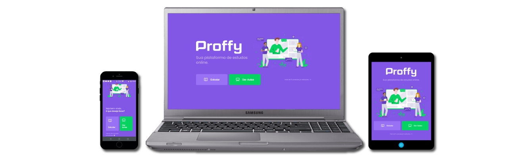
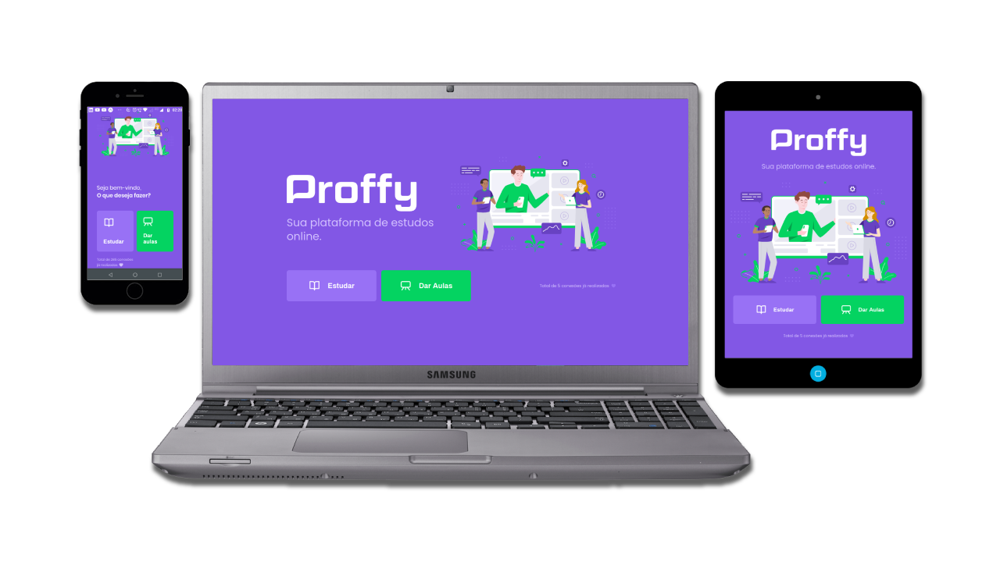

<div align=center>



![BADGE_LICENSE] ![BADGE_TYPESCRIPT] ![BADGE_WEB_REACT] ![BADGE_MOBILE_REACT_NATIVE] ![BADGE_SERVER_NODEJS] ![BADGE_OPEN_SOURCE] ![BADGE_NODE_VERSION] ![BADGE_NPM_VERSION] ![BADGE_OPEN_ISSUES] ![BADGE_CLOSED_ISSUES] ![BADGE_STARS] ![BADGE_FORKS]

<h3>

Projeto Open Source desenvolvido na #NextLevelWeek da [Rocketseat], utilizando **TypeScript**, **React**, **React Native** e **Node**. 

<!-- ### 🌐 <kbd>http://website.com</kbd> <br> 📥 <kbd>http://download.com</kbd>  -->

</h3>



</div>

## **:rocket: OBJETIVO**

O objetivo do projeto é criar uma plataforma de estudos, onde conseguimos conectar alunos e professores para realizarem aulas online.

<!-- ...CASOS DE USO -->

<kbd>[&uarr; ÍNDICE](#índice)</kbd>

<br>

<!-- ## **:movie_camera: PREVIEW**

<div align=center>


</div>

<kbd>[&uarr; ÍNDICE](#índice)</kbd>

<br> -->

## **:memo: DESENVOLVIMENTO**

  - **[✅ Análise de Requisitos](./docs/notes/requisitos.md)**
  - **[🏗️ Arquitetura do Repositório](./docs/notes/arquitetura-repo.md)**
  - **[💾 Modelagem dos Dados](./docs/notes/database-model.md)**
  - **[📦 Packages](./docs/notes/packages.md)**

<kbd>[&uarr; ÍNDICE](#índice)</kbd>

<br>

## **:computer: TECNOLOGIAS**

### **Website ([React] + [TypeScript])**

- **[React Router Dom](https://github.com/ReactTraining/react-router/tree/master/packages/react-router-dom)**
- **[Axios]**

\* Veja o arquivo <kbd>[package.json](./packages/web/package.json)</kbd> do projeto Web.

### **Server ([NodeJS] + [TypeScript])**

- **[Express]**
- **[DotEnv]**
- **[Knex]**

\* Veja o arquivo <kbd>[package.json](./packages/server/package.json)</kbd> do projeto Server.

### **Mobile ([Expo] + [TypeScript])**

- **[Axios]**
- **[Expo Google Fonts](https://github.com/expo/google-fonts)**
- **[React Navigation](https://reactnavigation.org/)**
- **[Expo Async Storage](https://docs.expo.io/versions/latest/sdk/async-storage/)**

\* Veja o arquivo <kbd>[package.json](./packages/mobile/package.json)</kbd> do projeto Mobile.

### **Utilitários**

- **Protótipo:** **[Figma](https://www.figma.com/)** | **<kbd>[Protótipo(Web)](https://www.figma.com/file/GHGS126t7WYjnPZdRKChJF/?viewer=1&node-id=)</kbd>** | **<kbd>[Protótipo(Mobile)](https://www.figma.com/file/e33KvgUpFdunXxJjHnK7CG/?viewer=1&node-id=)</kbd>** |
- **Editor:** **[Visual Studio Code](https://code.visualstudio.com/)** &rarr; Extensions: **<kbd>[VSCode_Plugin_SQLite]</kbd>**
- **Markdown:** **[StackEdit](https://stackedit.io/)**
- **Commit Conventional:** **[Commitlint]**
- **Teste de API:** **[Insomnia](https://insomnia.rest/)**
- **Fontes:** **[Google Fonts - Archivo](https://fonts.google.com/specimen/Archivo?query=archivo) | [Google Fonts - Poppins](https://fonts.google.com/specimen/Poppins?query=Poppins)**
- **Emojis:** **[Emojipedia](https://emojipedia.org/) | [Markdown Emoji](https://gist.github.com/rxaviers/7360908)**
- **Wireframe Editor:** **[Whimsical](https://whimsical.com/)**
- **Anotações / Checklist:** **[Notion](https://www.notion.so/)**
- **Ícones:** **[Ionicons](https://ionicons.com/) | [Feather Icons](https://feathericons.com/)**

<kbd>[&uarr; ÍNDICE](#índice)</kbd>

<br>

## **:wrench: CONFIGURAÇÃO DO AMBIENTE**

Veja o [arquivo de configuração do ambiente](./docs/notes/config-ambiente.md) para saber como configurar corretamente a sua máquina para utilizar o projeto.

<kbd>[&uarr; ÍNDICE](#índice)</kbd>

<br>

## **:wine_glass: COMO UTILIZAR**

### **Utilizando o Web**

```sh
# Abrindo o diretório Web no terminal:
$ cd ./packages/web

# Instalando as dependências do package.json:
$ yarn

# Iniciando o projeto utilizando o script 'start' do package.json:
$ yarn start
``` 

> O projeto será aberto em `http://localhost:3000`;

### **Utilizando o Server**

Você precisa renomear o arquivo `.env-example` para `.env` e inserir as informações que condizem com o seu **host**:

```sh
$ cd ./packages/server
$ mv .env-example .env
```

```sh
# Abrindo o diretório do Server no terminal:
$ cd ./packages/server

# Instalando as dependências contidas no package.json:
$ yarn

# Iniciando o Server utilizando o script 'start' do package.json:
$ yarn start

# Instanciando as tabelas do banco de dados:
$ yarn knex:migrate

# Voltando a última alteração feita na tabela:
$ yarn knex:migrate:rollback
```

### **Utilizando o Mobile**

Instale o aplicativo <kbd>[Expo](https://play.google.com/store/apps/details?id=host.exp.exponent&hl=en)</kbd> no seu smartphone.

```sh
# Abrindo o terminal no diretório do mobile:
$ cd ./packages/mobile

# Executando o mobile no modo de desenvolvimento:
$ yarn start
```

Agora, abra o aplicativo do expo e no modo **LAN** faça o scan do QRCode.

> *Se tiver algum problema para executar o aplicativo nesse modo, tente desabilitar o firewall da sua máquina.*

<kbd>[&uarr; ÍNDICE](#índice)</kbd>

<br>

## **:octocat: COMO CONTRIBUIR**
  
Siga as instruções do arquivo [como contribuir](./docs/notes/como-contribuir.md) para contribuir corretamente.

<kbd>[&uarr; ÍNDICE](#índice)</kbd>

<br>

## **:star2: AGRADECIMENTOS**

<div align=center>

<table style="width:100%">
  <tr align=center>
    <th><strong>Next Level Week</strong></th>
    <th><strong>Rocketseat</strong></th>
    <th><strong>diego3g</strong></th>
    <th><strong>maykbrito</strong></th>
  </tr>
  <tr align=center>
    <td>
      <a href="https://nextlevelweek.com/">
        
      </a>
    </td>
    <td>
      <a href="https://rocketseat.com.br/">
        
      </a>
    </td>
    <td>
      <a href="https://github.com/diego3g">
        
      </a>
    </td>
    <td>
      <a href="https://github.com/maykbrito">
        
      </a>
    </td>
  </tr>
</table>

</div>

<kbd>[&uarr; ÍNDICE](#índice)</kbd>

<br>

## **:books: REFERÊNCIAS**

- **[React + TypeScript Cheat Sheet](https://github.com/typescript-cheatsheets/react-typescript-cheatsheet)**
- **[ReactJS](https://reactjs.org/docs/getting-started.html) | [ReactJS pt-BR](https://pt-br.reactjs.org/docs/getting-started.html)**
- **[TypeScript](https://www.typescriptlang.org/docs/home.html)**
- **[dotenv & Typescript](https://blog.morizyun.com/javascript/library-typescript-dotenv-environment-variable.html)**

<kbd>[&uarr; ÍNDICE](#índice)</kbd>

<br>

## **:page_with_curl: LICENÇA**

Esse repositório está licenciado pela **MIT LICENSE**. Para mais informações detalhadas, leia o arquivo [LICENSE](./LICENSE) contido nesse repositório. 

<kbd>[&uarr; ÍNDICE](#índice)</kbd>

<br>

<h3 align="center">
Feito com ❤️ por <a href="https://www.linkedin.com/in/mauricioromagnoli/">Maurício Romagnoli</a>
<br><br>
<a href="https://www.alura.com.br/">
  
</a>
</h3>

<!-- Links -->

[Rocketseat]: https://rocketseat.com.br/
[React]: https://reactjs.org/
[TypeScript]: https://www.typescriptlang.org/
[NodeJS]: https://nodejs.org/en/
[Yarn]: https://yarnpkg.com/
[ReactNative]: https://reactnative.dev/
[Expo]: https://expo.io/
[Express]: https://expressjs.com/
[DotEnv]: https://github.com/motdotla/dotenv
[Knex]: http://knexjs.org/
[Commitlint]: https://github.com/conventional-changelog/commitlint
[VSCode_Plugin_SQLite]: https://marketplace.visualstudio.com/items?itemName=alexcvzz.vscode-sqlite
[asdf]: https://github.com/asdf-vm/asdf
[Axios]: https://github.com/axios/axios

<!-- Badges -->

[BADGE_LICENSE]: https://img.shields.io/github/license/x0n4d0/proffy
[BADGE_TYPESCRIPT]: https://badges.frapsoft.com/typescript/code/typescript.png?v=101
[BADGE_WEB_REACT]: https://img.shields.io/badge/web-react-blue
[BADGE_MOBILE_REACT_NATIVE]: https://img.shields.io/badge/mobile-react%20native-blueviolet
[BADGE_SERVER_NODEJS]: https://img.shields.io/badge/server-nodejs-important
[BADGE_OPEN_SOURCE]: https://badges.frapsoft.com/os/v1/open-source.png?v=103
[BADGE_NODE_VERSION]: https://img.shields.io/badge/node-12.18.0-green
[BADGE_NPM_VERSION]: https://img.shields.io/badge/npm-6.14.4-red
[BADGE_OPEN_ISSUES]: https://img.shields.io/github/issues/x0n4d0/proffy?color=green
[BADGE_CLOSED_ISSUES]: https://img.shields.io/github/issues-closed/x0n4d0/proffy?color=red
[BADGE_STARS]: https://img.shields.io/github/stars/x0n4d0/proffy?style=social
[BADGE_FORKS]: https://img.shields.io/github/forks/x0n4d0/proffy?style=social
